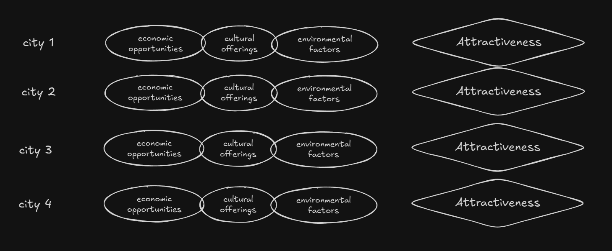
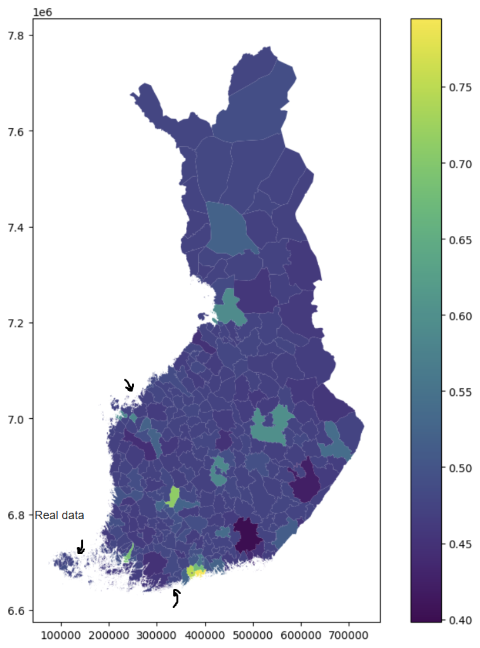

# Predicting City Attractiveness

What makes a city attract population?

A city has many features that may influence its attractiveness. These features include economic opportunities, quality of life, infrastructure, cultural offerings, and environmental factors, etc.

What if we could use Machine Learning to predict how attractive a city is based on its features?

###
To start, we need a way to quantify Attractiveness. It can be as simple as the population of a city. The more populated a city is the more attractive it probably is. The method of quantifying Attractiveness is flexible and improvable.

Then, we need data on many cities to analyze.

After we have the data, many things can be done, including prediction of attractiveness from city features. We have picked the cities on Finland as an example.

Here are all the cities of Finland except 3 missing ones, left out to demonstrate the prediction application. The cities are color coded by their attractiveness score.

    

Here, the 3 missing cities are filled in using their predicted attractiveness score. The prediction is learned from the remaining cities using machine learning.

    

Here are actually attractiveness scores of all the cities. You can see that the difference between predicted and actual scores, for the 3 missing cities, are not wildly off.

     

This was just a small toy demonstration, but the idea can be applied to much bigger problems: what feature has the most impact on population attraction, and can be optimized to attract work force to a city temporarily.
